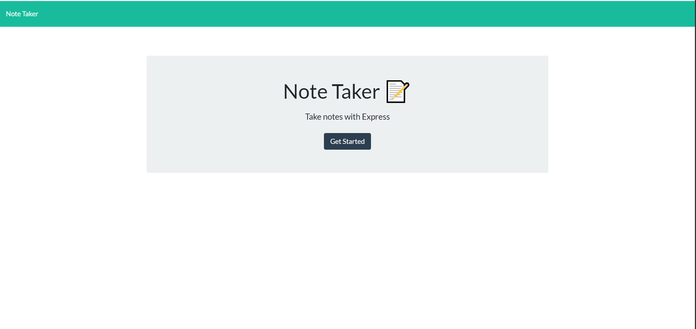
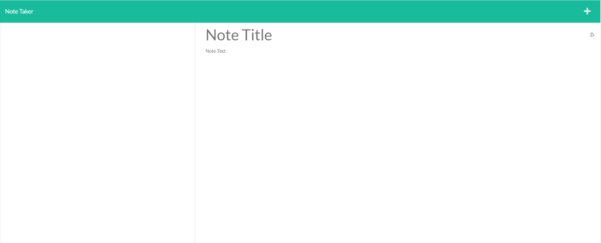

# note-taker

## Description
THe objective of this project is to create a note-taker application using express.js. The application would have the user create a note using a "Title" and "Text" and each note would be saved into a JSON file. The main purpose of this project is to build up the back end, route both ends, and deploy the application using Heroku.

## Technology Used
- Expres.js
- Heroku
- Insomnia (for debugging)
- node.js

## Testing
When launching the application it will bring you to the index.html page where the user can press the button "Get Started" to start posting notes. 

From there the user will be able to title their notes and write a description to it and save it to the db.json file 
